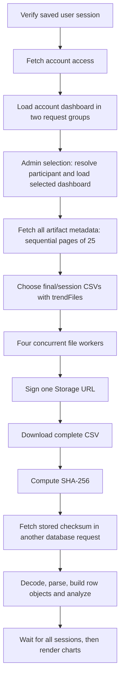

# Portal loading investigation — October 5, 2026 (Eastern)

This records the pipeline before optimization. The [SQL-backed replacement](portal-sql-pipeline.md) has since been implemented, applied to the hosted database and verified; current chart loads use SQL summaries.

The main bottleneck is fetching and rebuilding session metrics from complete historical CSVs on every page load. Supabase SQL execution is a small part of the observed delay. Reducing network requests helps immediately; storing derived session metrics would remove most of the work entirely.

**Current backend.** Both `env/staging.env` and the current compiled frontend target `cfpdbcvtrblrjjrdtoay.supabase.co`. The database connection targets the corresponding hosted `db.*.supabase.co` endpoint. A read-only Management API request confirmed an active, healthy project in `us-east-2`, running PostgreSQL 17.11. The hosted database contains 421 artifacts, 14 participants, and zero experiment runs/events. Historical CSV loading is therefore the relevant current path. The environment README's statement that the schema has not been applied to a hosted project is outdated.

**Pipeline.** The frontend contacts Supabase directly from the browser. Serving the frontend from this machine does not make this machine a database or Storage proxy.

The relevant code is `src/app.js:23`, `src/services/dashboard.js:2`, `src/portal.js:13`, `src/services/portal.js:14`, `src/services/portal.js:75`, and `src/portal-results.js:96`. Dashboard identity queries run in parallel, followed by another parallel group. Admin selection loads the selected dashboard after the signed-in account's dashboard. Choosing another user uses `location.assign` in `src/account-layout.js`, restarting the page and its in-memory CSV cache. The user directory itself loads on focus/open, rather than eagerly on every overview load.

The old PHP portal still contains a persistent disk metrics cache in `data_portal.php:954`. The current launchers serve the compiled JavaScript application, which instead caches parsed CSVs only inside the current page's module. That cache helps revisits within one page lifetime, but does not avoid the work after navigation or reload.

**Measured results.** The diagnostic used the actual CSV parser, metrics calculation, session-selection logic, 25-file manifest pages, and four-worker limit. It used a server API key for HTTP requests, and read-only SQL transactions with the `authenticated` role and admin/participant JWT claims for database query plans. Credentials, signed URLs, user identities and CSV contents are excluded from the saved results. No database/application data was changed.

The largest participant has 171 artifacts, of which 19 enter the overview. Those 19 CSVs total **36,578,030 bytes (36.6 MB / 34.9 MiB)** and 24,624 source rows.

| Historical overview replay | Current loader | Batched-signing comparison |
| --- | ---: | ---: |
| Manifest requests | 7 | 7 |
| Signing requests | 19 | 1 |
| CSV downloads | 19 | 19 |
| Separate checksum requests | 19 | 0 |
| Total HTTP requests | **64** | **27** |
| First measured run | **3.93 s** | **2.10 s** |
| Second measured run | **2.59 s** | **2.00 s** |
| Download bytes | 36.6 MB | 36.6 MB |
| Checksums and derived metrics | Verified | Verified and identical |

The comparison includes `sha256` in the manifest and uses Supabase's supported [createSignedUrls batch operation](https://supabase.com/docs/reference/javascript/storage-from-createsignedurls). It retains all four workers, CSV downloads, hash verification and metric calculations. This is implemented in the diagnostic only; the application's loader has not been changed.

These timings exclude browser session verification, dashboard requests, CORS preflights and chart rendering. An admin viewing another participant can incur another 13 application requests across seven sequential request groups before the manifest starts, assuming both accounts have participant records and no token refresh is needed. A roughly five-second browser load is consistent with the measured work, but the user's exact browser load was not profiled.

The benchmark ran current/batched and then batched/current, with no parsed-file cache between runs. All 19 downloads reported CDN `MISS` in each largest-participant run. Initial connection/origin warm-up and normal network variation still matter: these results support the request reduction, rather than a guaranteed 47% browser speedup. The smaller median participant had two sessions; its timings varied significantly with CDN hits and initial connection setup, so its first-run speed difference is not a useful isolated optimization estimate.

**Where the time goes.** For the largest participant, manifest loading took 0.38–0.56 s. Current individual signing requests averaged 73–102 ms; checksum queries averaged 64–80 ms. Downloads averaged 244–436 ms per CSV. Downloads run concurrently, so summing their individual durations would overstate wall-clock time. Parsing, row-object construction and analysis consumed approximately 0.70 s in total; hashing/decoding brought measured local work to approximately 0.77 s. Browser/device CPU performance can differ.

Authenticated SQL execution was 10.2–13.3 ms for an artifact page, 2.7–7.6 ms for the exact count, 0.5–0.9 ms for a checksum lookup, and 0.6–5.0 ms for a Storage authorization lookup. These targeted plans do not reproduce every PostgREST/Storage operation, but show that raw SQL is not consuming seconds for this participant. Adding indexes or increasing database compute is unlikely to address the main measured delay.

Fresh signed URLs can also reduce cache reuse: when Smart CDN is enabled, different signing tokens produce different cache keys. Reusing the same authorized URL permits hits, but an authorization-scoped metrics cache is more useful for this dashboard than repeatedly transferring raw CSVs. See [Supabase's signed URL caching behavior](https://supabase.com/docs/guides/storage/cdn/smart-cdn).

**Recommended changes, in priority order.**

1. Add a stored session-summary table or equivalent authorized API. Generate metrics once on import/run completion, with a source checksum and metrics-version identifier. Store totals, catch-test results, durations, per-difficulty groups and mean difficulty required by the existing charts. Keep the same participant/admin RLS access. Fetch summaries for overview charts; retrieve full CSVs/events when previewing or downloading. This removes the 36.6 MB transfer and repeated analysis from ordinary overview loads. Reuse the current scientific definitions and final-versus-chunk selection rules.
2. For a smaller first patch, select `sha256` with artifact metadata and batch URL signing by bucket. The diagnostic demonstrates 64 to 27 HTTP requests while retaining checksum verification.
3. Give the manifest a larger page size distinct from the 25-row display pagination, or expose a paginated overview-specific query. With 171 artifacts, a 500-row manifest would replace seven sequential calls with one. Avoid repeating an exact count unnecessarily. Preserve complete traversal for users exceeding one page.
4. Reduce repeated dashboard loads and render usable results progressively. Cache derived data with user/access and source-version boundaries. The current generation counter protects rendered results but does not cancel obsolete network work. Recorded runs are a future scaling issue: `recordedSessions` reads each run serially and fetches event pages of 500; the project currently has no such runs to benchmark.

**Hosting comparison.** This machine has a Ryzen 5 7600X with six cores/twelve threads, approximately 29 GiB RAM (26 GiB available), and 335 GiB free on an NVMe filesystem. That exceeds Supabase's recommended four cores, 8 GB RAM and 80 GB SSD. Docker and its daemon socket were not found; no production self-hosted stack was established by this investigation. Supabase recommends Docker for self-hosting, and distinguishes its production deployment from the CLI's local development stack. See [hardware/setup requirements](https://supabase.com/docs/guides/self-hosting/docker) and [self-hosting responsibilities](https://supabase.com/docs/guides/self-hosting).

| Choice | Expected effect for this application | Tradeoff |
| --- | --- | --- |
| Keep cloud; load stored summaries | Removes raw-file traffic and recalculation on normal overview loads | Add summary generation, versioning and authorization |
| Keep cloud; batch current file loading | Measured reduction to 27 requests and about two seconds for this participant | Still transfers every selected CSV |
| Self-host on this machine | Likely lower latency for same-machine/LAN clients; actual improvement requires a local-stack benchmark | Remote clients depend on this server's network route and upload bandwidth; repeated downloads/parsing remain |

Placing Supabase beside the static frontend does not remove round trips for remote users: their browsers would still call the backend directly over the network. Local/LAN access can reduce those waits substantially. The current server's external upload capacity, location relative to users and remote-client timings were not measured, so there is no supported exact self-hosted speed estimate.

Self-hosting also transfers responsibility for updates, availability, monitoring, backups and recovery to the operator; managed backups/PITR and the Management API are not supplied by the self-hosted platform. This application would need its database/Auth data and 421 Storage objects transferred, `username-auth` installed, and keys, SMTP and callback settings configured. Database restore alone does not transfer object bytes or redeploy functions. See [platform-to-self-hosted migration coverage](https://supabase.com/docs/guides/self-hosting/restore-from-platform).

Repository-specific migration work includes changing the hosted-only URL checks in `scripts/lib/local-env.mjs:30` and database host checks in `scripts/lib/staging-db.mjs:4`; replacing cloud Management API/CLI provisioning/deployment paths; updating public Vite values and rebuilding; and configuring function keys/origins for the new gateway. Preserve private buckets and RLS. A production deployment needs HTTPS and independent database/object backups. A later cutover should preserve the hosted project until restore, authentication, authorization and file-integrity checks pass.

My recommendation is to keep the current cloud deployment and implement stored summaries first. Self-hosting is feasible on this hardware and is a reasonable separate decision for local operation or infrastructure control. It is not necessary to remove the main measured bottleneck.

**Reproduction and artifacts.** Run `node scripts/profile-portal-load.mjs` from the repository root with the existing protected staging environment and network access. It performs read-only queries, generates temporary signed download URLs, and writes the anonymous result to `test/results/portal-performance.json`. Syntax checking passed; all replayed files passed their checksums and both variants produced identical metrics. No application source, migration or backend configuration was changed.
