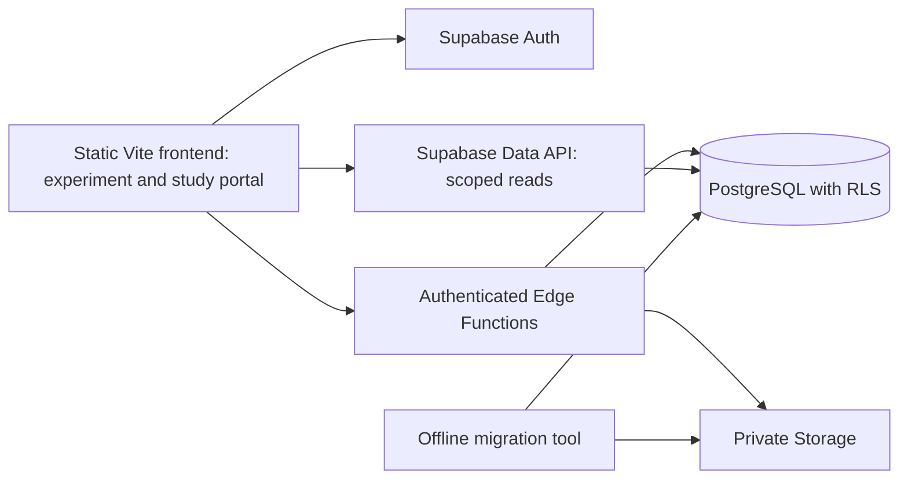

# Supabase and user-centered refactor plan

## Outcome and scope

Replace PHP and server-side CSV persistence with Supabase PostgreSQL, Auth, private Storage, and a small set of Edge Functions. Preserve and import all existing artifacts in `server-data.zip`. Require authenticated accounts for both the experiment and study/data portal. Give each user persistent, explicitly managed display and training settings, with mandatory setup and confirmation before running a task.

This document is an implementation plan; it does not provision services, import production data, or change experiment behavior yet.

Planning assumption: “study” includes the existing `/data-portal` study/results interface. If a separate study participation flow is added, it must use the same authentication, enrollment, and parameter gates. Participants see their own results; researchers see only studies assigned to them; administrators manage accounts and legacy-data links.

## 1. Current system and migration evidence

- `src/main.js` contains experiment setup, participant-ID entry, display calibration, stimulus-position editing, task generation, staircase behavior, pause/replay, chunk autosaves, and final CSV saving.
- `save_data.php` persists uploads; `router.php` and `data_portal.php` serve the portal, authenticate its users, scan files, and calculate CSV-based metrics.
- `data-portal/app.js` presents files, previews, user trends, accuracy, difficulty, and duration through PHP endpoints. Its authentication is separate from experiment participant-ID entry.
- `start-server.sh` and `aws-start-server.sh` copy PHP into `dist` and preserve old `dist/data` before rebuilding. New persistent data must be independent of frontend builds.
- Existing task configuration includes Motion, Orientation, Centrality, and Bar; the current portal hides some unused tasks. Preserve deployment task visibility and experimental logic during this refactor.

Archive inspection on October 4, 2026:

| Item | Observed count |
|---|---:|
| Files | 419 |
| Uncompressed bytes | 225,727,596 |
| CSV files | 406 |
| CSV data rows, before reconciliation | 144,369 |
| Distinct nonempty `user_id` values in CSV rows | 12 |
| CSV header variants | 14 |
| Backup files (`.bak`) | 9 |
| JSON files | 1 |
| Text files | 2 |
| `.gitkeep` files | 1 |

The CSVs include 337 `session_chunk_complete`, 47 `final_complete`, 21 `pause_checkpoint`, and one older `user_...` file. All 406 CSVs parsed with Python's CSV reader without decoding/parser exceptions or surplus columns. These checks do not establish semantic validity or uniqueness. Many `trial_category` cells are empty, so response identification must also use task-specific fields and trial types. The JSON file is a derived portal metrics cache, not authoritative trial data.

Final, chunk, and pause saves can overlap. **144,369 is a source-row count, not a unique trial count.** One experimental trial also generates multiple jsPsych event rows. Importing every row directly as a new trial would inflate results.

## 2. Target architecture

Keep Vite, jsPsych, existing task rendering, and portal charts. Introduce `@supabase/supabase-js` and shared application services. No framework rewrite is required. Build all experiment and portal entry points through Vite so they share the same authentication/client modules.

Use Edge Functions for username login, enrollment/session creation, validated trial ingestion, controlled legacy linking, and large exports where necessary. Use authenticated Data API reads or narrowly scoped SQL RPCs for profiles, settings, session summaries, and paginated results.

Host static assets on a static web host with redirects for existing task and portal URLs. Do not expose archive files or database credentials in the deployed bundle. No PHP process remains after cutover. Choose a Supabase region close to participants and select capacity from measured database, index, and raw-file sizes; user count alone is insufficient.

## 3. Account and authorization model

### Registration and username sign-in

Supabase's native password authentication uses email or phone, not arbitrary usernames. Implement a deliberate username layer rather than treating a participant ID as a password or inventing a password store.

1. Registration collects username, email, password, and applicable study consent. Normalize usernames with a documented policy: trim, lowercase for uniqueness, and a restricted character set; preserve a display label separately.
2. Use Supabase Auth for password storage, email verification, password reset, session refresh, and logout. Reserve the normalized username transactionally in a restricted identity table through a controlled signup flow. Clean up pending reservations if signup fails/expires; reject competing reservations with a database unique constraint.
3. Provide a username/password login Edge Function. Resolve the username to its Auth email server-side, then use Supabase's normal password sign-in API. Do not return the email mapping, persist passwords, or log credentials. Return the normal Supabase session to the client and establish it through the SDK.
4. If the username is absent, show “Username not registered. Create an account,” prefill the registration form, and require registration before access. A registration transaction is the final authority on availability.
5. This explicitly requested unknown-username flow reveals account existence. Limit the lookup/login endpoint by IP and username, expose only availability, and use generic messages for invalid passwords and account recovery. No public username directory or unrestricted profile queries.
6. Restore sign-in across experiment and portal navigation. Redirect signed-out users to sign-in and preserve a validated same-origin return route. Expired sessions pause submission and request reauthentication without losing queued events.

### Roles and legacy ownership

- New registrations receive participant access only. A username, URL parameter, or editable profile field cannot grant researcher/admin privileges.
- Store study membership and roles in server-managed tables, with RLS policies based on `auth.uid()` and authorized study scope.
- Existing numeric/alphanumeric legacy IDs are not login credentials. Import them as unclaimed participant records. Link historical records to a verified account through a researcher/admin workflow or a separately verified invitation. A matching username alone cannot claim another person's history.
- If a username already belongs to an imported legacy participant but has no Auth identity, guide the person through registration and the verified linking flow; do not overwrite that participant or attach records automatically.
- Protect all portal API reads, exports, Storage downloads, session mutations, and alternate task routes. Frontend redirects are UX; database policies and function authorization enforce access.

## 4. Data model

Use UUID primary keys, UTC timestamps, explicit foreign keys, and versioned SQL migrations. Separate Auth identity from research participant identity so imported history can exist without an account.

| Table | Purpose and key fields |
|---|---|
| `profiles` | `auth_user_id`, display username, account preferences; excludes credentials and role authority |
| `private.account_identifiers` | Unique normalized username, Auth user reference, pending reservation state; unavailable through public Data API |
| `participants` | Stable research identity, nullable unique Auth link, provenance; preserve legacy labels separately |
| `legacy_identity_links` | Source namespace + original participant ID → participant UUID; verified account-link audit |
| `studies`, `study_memberships`, `enrollments` | Protocol/version, researcher scope, participant enrollment and consent version/time |
| `display_profiles` | User-owned named display setup, physical dimensions, viewing distance, observed viewport/resolution/DPR, version and confirmation time |
| `training_settings` | Participant/study/task preferences: selected locations, X/Y offsets in degrees, display-profile reference, version and confirmation time |
| `experiment_runs` | Participant, study, task, protocol/code versions, status, start/end times, immutable parameter snapshot, import origin |
| `run_chunks` | Existing within-run chunk boundaries, status and counts; distinguish chunks from complete experiment runs |
| `trial_attempts` | Run, logical trial number, attempt/replay number, task/position, correctness, reaction time, difficulty, catch-trial flag, completion/interruption state |
| `experiment_events` | Stable event ID, attempt link where applicable, client sequence/trial index, event phase/type, original jsPsych payload in JSONB |
| `ingest_batches` | Run + idempotency key, payload hash, acknowledgement and sequence information |
| `import_jobs`, `source_files`, `source_rows`, `source_row_links` | Archive/file hashes, raw row JSON, file row ordinal, mapping to canonical events, reconciliation status |
| `artifacts` | Private Storage references for original ZIP/files, backups, logs, large recordings, and exports |

Typed columns support common queries; JSONB preserves variable task parameters and unknown historical fields. Keep raw source cells as strings before conversion so empty cells, `null`, zero, and missing columns remain distinguishable. Avoid repeating large stimulus HTML in typed trial summaries.

Indexes: participant/study/run start time; study/task/start time; run/event sequence; run/logical-trial/attempt; participant/task settings; study membership and other RLS join keys. Add unique constraints for event UUID, `(run_id, logical_trial_number, attempt_number)`, `(run_id, batch_key)`, and source-file hash + row ordinal. Do not add JSON indexes until a concrete query requires them.

RLS: participants read their own approved results/settings and cannot modify canonical trial history or enroll themselves in restricted studies. Researchers read assigned studies; admins manage membership and identity linking. Authenticated ingestion validates run ownership, enrollment, session state, and parameter completeness. Either write with the caller's RLS context or explicitly verify all scope before any privileged transaction. Raw migration staging remains restricted to the importer/admin.

## 5. Required user parameter management

Flow: **Sign in/register → user dashboard → required setup → task-specific position preview → confirm setup → create run → instructions and trials → synchronized results.** The study portal also requires sign-in; viewing historical results need not require recalibration. Starting any study task does.

Move existing calculator and position-editor logic into reusable settings components rather than discarding it. Store defaults per user/display/task, but never silently accept hardcoded physical measurements.

- Require measured visible screen width/height in centimeters and viewing distance in centimeters. Explain how to measure them. Browser-reported values cannot determine physical dimensions reliably.
- Record CSS viewport dimensions, browser screen dimensions, device pixel ratio, and fullscreen state separately. Distinguish CSS pixels from physical device pixels. Calculate visual geometry in the units used by the renderer, maintaining separate horizontal/vertical conversion factors.
- Require selection/confirmation of training positions, X/Y offsets in degrees, and task-specific constraints. Preserve existing Bar restrictions and mirrored position semantics.
- Preview the full stimulus bounds, not only its center. Reject nonfinite/invalid values and offscreen geometry for the chosen task. Use consistent validation in frontend and session-creation backend.
- Permit named display profiles for multiple screens. Reuse saved values as editable inputs; require confirmation before every run. Invalidate confirmation when the display/viewport/DPR changes or relevant settings change. Changes during a run trigger pause and reconfirmation or a new run as appropriate.
- Bind the run to an immutable snapshot of confirmed input values, derived geometry, selected positions, settings versions, protocol version, and confirmation time. Editing future defaults never changes historical results.
- Do not let participants edit investigator-controlled trial counts, staircase rules, catch proportions, or restricted protocol conditions. If studies prescribe location limits, enforce them while still requiring user confirmation of the allowed setup.
- Keep legacy calibration as historical metadata; missing imported fields stay unknown. Imported settings may prefill a draft only after account linking and must be confirmed before a new run.

## 6. Reliable data submission and retrieval

Replace filename-based saves with structured JSON batches. Create the run online after authentication and setup validation. The server determines the participant from the authenticated identity, never a submitted username or `user_id`.

1. Assign stable event and attempt IDs before enqueueing. Separate logical trials from jsPsych phases, catch trials, and replay attempts.
2. Write completed events into an IndexedDB outbox, then upload small bounded batches outside timing-sensitive stimulus callbacks. Flush at trial boundaries, breaks, pauses, and completion; do not depend on unload requests.
3. Validate request size, schema version, finite numeric values, task/protocol constraints, ownership, and run state. Commit each batch atomically through a scoped database function. Repeated keys with identical payloads return the original acknowledgement; changed payloads conflict rather than overwrite history.
4. Delete outbox entries only after acknowledgement. Retry temporary failures with backoff; pause when authentication expires or the queue exceeds a defined storage limit. Display pending/saved/error states accurately.
5. Track interrupted attempts explicitly, preserving the current rule that forced interrupted attempts do not count as completed responses. A replay receives a new attempt identity.
6. Completion is a server-validated transition only after all expected acknowledged records arrive. Preserve incomplete/abandoned runs. Initial scope supports reliable synchronization and explicit restart, not automatic mid-trial resume; true resume requires persisted staircase/RNG/checkpoint state and separate validation.
7. Scope the outbox by authenticated owner. On logout/account switch, never upload another account's pending data; explain pending items and require the original owner to sign in to synchronize them.

Replace portal file scans with paginated session/trial queries and server-side aggregates for accuracy, difficulty, response times, catch performance, and active/rest duration. Preserve current chart definitions and America/New_York date grouping, while storing actual timestamps in UTC. Use RLS-aware views/RPCs with appropriate invoker permissions. Keep CSV as an authenticated export derived from the database; raw legacy downloads remain scoped private artifacts.

## 7. Import all data from `server-data.zip`

Create `scripts/import-legacy-data.py`, a versioned mapping specification, and a machine-readable reconciliation report. Run locally/staging first; use a protected database connection for bulk staging/COPY, not credentials in browser code.

### A. Inventory and preserve

- Hash the ZIP and every entry; generate a manifest with path, size, type, and checksum. Validate extraction paths against traversal and symlinks, cap expansion, and extract outside the public site directory.
- Preserve the original ZIP and all 419 files in a private archive bucket. Classify all CSVs, nine backups, logs, metrics cache, and `.gitkeep`; none disappear silently. Sanitize filenames for object keys while retaining original paths in the manifest.
- Parse CSV-shaped `.bak` files as historical versions into staging when possible, preserving failures as explicit report entries. Cache/log/support files remain archived artifacts; do not turn cached metrics into extra trials.

### B. Stage and normalize

- Import all 144,369 primary CSV rows into provenance staging with file hash and row ordinal. Keep original values and full raw files; apply explicit conversions to JSON, booleans, numbers, task names, and times.
- Handle all 14 header variants, multiline quoted HTML, absent columns, calculator/position JSON, response formats, and older files with missing save metadata. Quarantine malformed semantic values for review while retaining their raw rows.
- Resolve legacy IDs from row fields and filename metadata. Report conflicts, missing IDs, sanitization collisions, and conflicting backup versions; never silently choose a filename identity over row data.
- Recover calibration and position snapshots per run. Do not fabricate defaults for missing historical values.

### C. Reconcile canonical runs, events, and trials

- Infer run candidates from participant, task, filename run timestamp and corroborating metadata; distinguish `save_created_at` (upload time) from experiment start. Filename timestamps lack a timezone suffix: verify producer behavior, retain originals, and mark uncertain older values rather than inventing UTC instants.
- Within a verified run, map repeated events across final/chunk/pause files using original `trial_index`, event phase/type, elapsed time, logical trial number, chunk fields, and scientific payload. Exclude per-save metadata from equivalence checks.
- Use deterministic import IDs from verified run identity and event keys. Treat verified full-final files as the preferred complete representation, then add nonoverlapping chunk/checkpoint events; resolve field conflicts explicitly with provenance and a report. Do not assume a preferred final file automatically makes every contradictory record disposable.
- Preserve interrupted/replayed attempts and separate catch trials. For ordinary responses with blank `trial_category`, use reviewed task-specific response predicates derived from current/legacy portal behavior. Link all source occurrences to canonical records.
- Ambiguous overlaps stay preserved in staging and are excluded from canonical analytics pending review. Do not deduplicate merely on participant/date/trial number; separate runs may share those values.

### D. Validate and accept

- Reconcile archive entries and checksums exactly; primary staging row count must equal 144,369. Report backup rows separately. Assign every source row a status: mapped, duplicate occurrence, conflict, nontrial event, or unresolved.
- Compare per-participant/task/run/chunk counts, response/catch counts, accuracy, difficulty trajectories, and duration metrics against sampled CSVs and existing portal calculations. Document intentional corrections where CSV overlap previously inflated metrics.
- Require all unexplained losses/conflicts to be resolved or explicitly accepted before production cutover. Record canonical counts only after reconciliation; do not promise a unique-trial total from the inventory.
- Re-run the importer to demonstrate idempotency: no duplicate artifacts, staging rows, runs, events, or attempts. Import the final production delta after old writes stop.
- Keep historical participant identities unclaimed until verified account linking; researcher/admin access can review imported history immediately within assigned study scope.

## 8. Implementation sequence and deliverables

1. **Baseline and contracts:** Capture present task/pause/replay behavior, portal metrics, archive manifest, and username/protocol rules. Define payload schemas and expected import reconciliation. Decide region, study roles, enrollment rules, and username/email registration UX.
2. **Database foundation:** Add `supabase/config.toml`, SQL migrations, RLS policies, private buckets, roles/enrollment tables, geometry validation, transactional ingestion functions, and anonymized seed fixtures. Configure backups and independently preserve Storage artifacts; database backups do not include Storage object contents.
3. **Shared authentication and dashboard:** Add `src/services/supabase.js`, auth/profile services, login/register/recovery pages, route guards, username endpoint, and scoped dashboard. Replace portal's PHP sessions and manual experiment ID entry. Preserve old links with redirects.
4. **Parameters and session start:** Extract geometry/settings modules from `src/main.js`, add display and per-task editors, validation/previews, enrollment checks, immutable snapshots, and server-validated run creation. Scope experiment/read-aloud shortcuts so they do not intercept typing in auth/settings fields.
5. **Data pipeline:** Add run/event adapters and IndexedDB outbox; replace `saveDataToServer`, filename/chunk save state, pause saves, and final saves with batch ingestion and acknowledgements. Preserve scientific logic and expose synchronization state.
6. **Import tooling and rehearsal:** Implement preservation/staging/reconciliation, import the archive to staging, validate metrics and ownership, and produce manifest/report artifacts. Test twice for idempotency and review conflicts.
7. **Study portal:** Refactor `data-portal/app.js` into Vite modules; replace PHP login/files/trends/download endpoints with scoped Supabase queries and exports. Organize navigation around users, runs, and settings rather than filenames. Add controlled legacy-account linking for admins.
8. **Cutover and PHP removal:** Run acceptance checks in staging, stop legacy submissions, capture/import the final data delta, verify reconciliation, and switch frontend configuration. Remove `save_data.php`, `data_portal.php`, and `router.php` from active deployment and replace PHP startup/copy steps with static serving. Archive legacy source/data securely; CSV export may remain.

Keep frontend changes incremental: `src/main.js` becomes an experiment entry/orchestrator; extract `src/auth/`, `src/settings/`, `src/experiment/`, `src/data/`, and shared portal services along natural boundaries. Avoid changing stimulus timing or staircase algorithms while moving storage/auth code.

## 9. Acceptance criteria and meaningful verification

- Signed-out users cannot start tasks, view study data, query protected records, or download artifacts, including through direct URLs/API calls.
- Unknown usernames lead to registration; concurrent registrations cannot claim the same normalized username; verified login, refresh, reset, and logout work across both interfaces.
- Participant A cannot read/write participant B's data or parameters. Researchers cannot access unassigned studies or grant themselves roles. Legacy username matches cannot claim history.
- Missing/invalid/unconfirmed display or position settings block run creation server-side. Confirmed settings persist across visits; display changes invalidate confirmation; edits never mutate old snapshots.
- Trial correctness, staircase updates, catch trials, pause/replay exclusions, position rendering, fullscreen behavior, and chart definitions match the baseline.
- Duplicate retries create one canonical event. Partial failures, expired authentication, network interruptions, reloads, and account switches retain owner-scoped pending records. Final status cannot falsely report synchronization.
- All 419 archive files are accounted for; all 144,369 primary CSV rows are staged with provenance; all schemas and supporting backups are covered; reconciliation and rerun checks pass.
- Portal results match validated canonical data with paginated queries. Measure ingestion latency and participant/researcher queries against a staging dataset approximating one million logical trials plus their event rows; set operational thresholds from these measurements, without assuming one million trials equals one million events.
- Run SQL policy/constraint tests, focused importer fixtures (overlap/conflicts/legacy IDs), ingestion integration tests, browser tests for auth/setup/synchronization, and `npm run build`. Use anonymized fixtures rather than committing participant data.

## 10. Operations and rollout boundaries

Separate local/staging/production projects or equivalent isolation. Commit schema migrations and function code; keep production credentials outside source control and Vite environment variables. Only the project URL and publishable key belong in the client. Configure Auth redirect URLs, verification/reset email delivery, and durable rate limits for public auth endpoints.

Monitor submission failures, pending queue age, import conflicts, database/storage growth, and slow portal queries. Verify database and Storage restoration independently. Set retention policies for originals, research records, exports, and account linkage with the study owner.

Keep the legacy deployment and immutable archive available for recovery during the transition. If rollback is needed after new submissions, preserve/export new PostgreSQL records and explicitly reconcile them before reopening any old writer; merely restoring PHP would create split histories. Avoid public dual writes.

Implementation dependencies: Supabase project access, deployment host configuration, outbound email configuration, study/researcher membership assignments, and a verified procedure for linking legacy participants. These do not block writing this plan; they must be available before production rollout.

## References

- [Supabase architecture](https://supabase.com/docs/guides/getting-started/architecture)
- [Password authentication: email/phone identities](https://supabase.com/docs/guides/auth/passwords)
- [Securing data and frontend keys](https://supabase.com/docs/guides/database/secure-data)
- [Row-level security](https://supabase.com/docs/guides/database/postgres/row-level-security)
- [Edge Function authorization](https://supabase.com/docs/guides/functions/auth)
- [Importing data](https://supabase.com/docs/guides/database/import-data)
- [Database migrations](https://supabase.com/docs/guides/deployment/database-migrations)
- [Database and Storage backup boundaries](https://supabase.com/docs/guides/database/overview)
